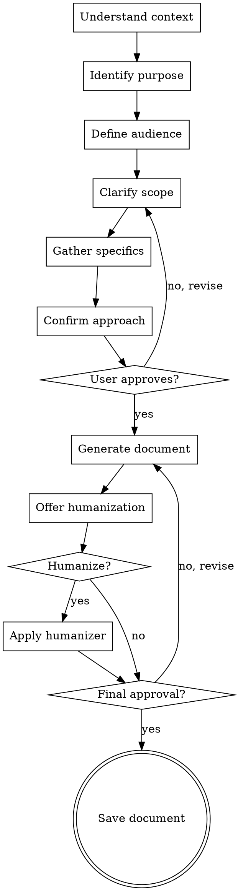

# Document Brainstorming

Turn document requests into precisely tailored documents through collaborative discovery.

<HARD-GATE>
Do NOT generate any document until you have completed the brainstorming process and gotten user approval on the approach. This applies to EVERY document regardless of perceived simplicity.
</HARD-GATE>

## Anti-Pattern: "I Already Know What They Need"

Every document request goes through this process. A simple status report, a quick PRD, a basic project charter — all of them. "Simple" requests are where unexamined assumptions cause the most rework. The discovery can be brief for truly simple needs, but you MUST confirm understanding before generating.

## Checklist

You MUST complete these items in order:

1. **Understand context** — What's the situation? Who's involved? What's at stake?
2. **Identify purpose** — Why does this document exist? What outcome is desired?
3. **Define audience** — Who will read this? What do they care about?
4. **Clarify scope** — What's in/out? How detailed should it be?
5. **Gather specifics** — Names, dates, metrics, constraints, preferences
6. **Confirm approach** — Summarize understanding, get explicit approval
7. **Generate document** — Create based on validated requirements

## Process Flow



## The Process

### Step 1: Understand Context

Ask ONE question to understand the situation:

**Examples:**
- "What's happening that's making you need this document right now?"
- "Tell me about the situation that requires this [document type]"
- "What's the background here? What led to this request?"

**What you're trying to learn:**
- Is this proactive or reactive?
- Is there urgency or pressure?
- Is this a new initiative or continuation?
- Are there political/organizational dynamics?

### Step 2: Identify Purpose

Ask ONE question about outcomes:

**Examples:**
- "What do you want to happen as a result of this document?"
- "What's the main thing you want readers to do/think/feel after reading this?"
- "If this document is successful, what does that look like?"

**What you're trying to learn:**
- Is this for decision-making, information, alignment, or action?
- What's the primary vs secondary goals?
- What would failure look like?

### Step 3: Define Audience

Ask ONE question about readers:

**Examples:**
- "Who's going to read this? What do they care about?"
- "Who's the primary audience? Any secondary audiences to consider?"
- "What does your reader already know? What do they need explained?"

**What you're trying to learn:**
- Primary vs secondary audiences
- Audience expertise level
- Audience concerns/priorities
- Audience attention span

### Step 4: Clarify Scope

Ask ONE question about boundaries:

**Examples:**
- "How detailed should this be? Quick overview or deep dive?"
- "What should I definitely include? What should I leave out?"
- "Are there specific sections or topics you want emphasized?"

**What you're trying to learn:**
- Length/depth expectations
- Must-have vs nice-to-have sections
- Topics to avoid
- Level of formality

### Step 5: Gather Specifics

Ask focused questions to fill in details (still one at a time):

**Examples:**
- "What's the project/feature/initiative called?"
- "Who are the key stakeholders I should mention?"
- "Are there specific dates, metrics, or targets I should include?"
- "Any preferred terminology or naming conventions?"
- "Are there existing documents I should reference or align with?"

**What you're trying to learn:**
- Concrete names, dates, numbers
- Organizational conventions
- Reference materials
- Constraints and requirements

### Step 6: Confirm Approach

Summarize your understanding and get explicit approval:

**Template:**
```
Based on our conversation, here's what I understand:

**Document:** [type]
**Context:** [situation]
**Purpose:** [desired outcome]
**Audience:** [who's reading]
**Scope:** [depth, emphasis, exclusions]
**Key details:** [specifics gathered]

I'll create a [length] document focused on [main emphasis],
with sections on [key sections]. Does this sound right?

Any adjustments before I generate?
```

**Do not proceed until user confirms.**

### Step 7: Generate Document

After approval, invoke the specific document skill and generate.

## After Document Generation

### Offer Humanization

Always ask after showing the generated document:

> "Would you like me to humanize this document? I can make it sound more natural, less AI-generated, and more like something a real person wrote."

**If yes:** Use the `document-humanizer` skill to polish the document.

**If no:** Proceed to final approval.

### Final Approval

Before saving, always ask:

> "Does this document meet your expectations? Should I save it?"

**If confirmed:** Save to appropriate folder with kebab-case filename.

**If changes needed:** Iterate based on feedback, then repeat approval step.

## Question Guidelines

### One at a Time
- Never ask multiple questions in one message
- If a topic needs more depth, ask follow-ups separately
- Wait for answer before moving to next topic

### Prefer Multiple Choice
- Easier for user to answer quickly
- Helps narrow down options
- Can always offer "Other" for flexibility

**Example:**
```
Bad:  "Who's the audience and what do they care about and how technical are they?"
Good: "Who's the primary audience for this document?"
      a) Executive leadership (need high-level, business impact)
      b) Engineering team (need technical details)
      c) Mixed stakeholders (need balanced approach)
      d) Other: _______
```

### Adapt to Context
- Simple requests = fewer, shorter questions
- Complex documents = more thorough discovery
- Urgent situations = streamline while still confirming
- User providing details = acknowledge, fill gaps only

## Red Flags

Stop and clarify when:

| Thought | Reality |
|---------|---------|
| "The user said PRD, I know what they need" | PRDs vary wildly. Confirm scope and audience. |
| "This is a simple status report" | Simple to whom? Audience defines complexity. |
| "They gave me lots of info, I'm good" | You may have info but not understanding. Confirm. |
| "I'll just use the template as-is" | Templates need adaptation. Confirm customization. |
| "The request was specific enough" | Specific ≠ complete. Always verify understanding. |

## Discovery Checklist by Document Type

### Project Charter
- [ ] Project name and sponsor
- [ ] Business justification
- [ ] High-level scope and exclusions
- [ ] Key stakeholders and their interests
- [ ] Success criteria
- [ ] Timeline/budget constraints

### PRD
- [ ] Feature/product name
- [ ] Problem being solved
- [ ] Target users
- [ ] Success metrics
- [ ] Must-have vs nice-to-have features
- [ ] Timeline constraints
- [ ] Dependencies

### Status Report
- [ ] Project name and phase
- [ ] Reporting period
- [ ] Key accomplishments
- [ ] Current blockers
- [ ] Next period priorities
- [ ] Audience (team vs leadership)

### GTM Strategy
- [ ] Product/feature name
- [ ] Launch timeline
- [ ] Target market/segments
- [ ] Pricing model (if relevant)
- [ ] Key differentiators
- [ ] Success metrics
- [ ] Budget constraints

### Risk Register
- [ ] Project/initiative name
- [ ] Known risks already identified
- [ ] Risk tolerance of organization
- [ ] Areas of most concern
- [ ] Review cadence needed

## Transition to Document Creation

Once discovery is complete and approved:

1. **Announce:** "Using [document-skill] to create your [document type]"
2. **Invoke:** Call the specific document skill
3. **Generate:** Create document based on gathered requirements
4. **Show:** Display complete document for review
5. **Offer humanization:** Ask about humanizing
6. **Get approval:** Confirm before saving
7. **Save:** Write to appropriate folder

**The terminal state is a saved, approved document.**
