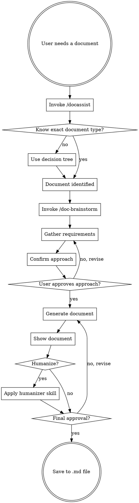

# Doc Assist

Your intelligent guide for choosing and creating the right business document.

<EXTREMELY-IMPORTANT>
If you think there is even a 1% chance a document skill might apply to what you're doing, you ABSOLUTELY MUST invoke /docassist first.

IF A DOCUMENT NEEDS TO BE CREATED, YOU DO NOT HAVE A CHOICE. USE THE RIGHT SKILL.

This is not negotiable. This is not optional. You cannot rationalize your way out of this.
</EXTREMELY-IMPORTANT>

## The Rule

**Invoke /docassist BEFORE creating any business document.** Even a 1% chance you need a document means you should check. If you're unsure which document, use /docassist to find out.

## Complete Document Creation Flow



## Workflow Stages

### Stage 1: Document Discovery

Use the decision tree below to identify the right document, or confirm if user already knows.

### Stage 2: Requirements Gathering

**ALWAYS invoke /doc-brainstorm after identifying the document.**

The brainstorming skill will:
- Understand context and situation
- Identify purpose and desired outcomes
- Define audience and their concerns
- Clarify scope and depth
- Gather specific details (names, dates, metrics)
- Confirm approach before generation

<HARD-GATE>
Do NOT generate any document until /doc-brainstorm completes and user approves the approach.
</HARD-GATE>

### Stage 3: Document Generation

After approval, invoke the specific document skill to generate content.

### Stage 4: Humanization Offer

After showing the generated document, always ask:

> "Would you like me to humanize this document? I can make it sound more natural, less AI-generated, and more like something a real person wrote."

**If yes:** Invoke `document-humanizer` skill to polish.

### Stage 5: Final Approval & Save

Before saving, always ask:

> "Does this document meet your expectations? Should I save it?"

**If confirmed:** Save to appropriate folder with kebab-case filename.

**If changes needed:** Iterate based on feedback.

## Red Flags

These thoughts mean STOP—you're rationalizing:

| Thought | Reality |
|---------|---------|
| "I'll just write a quick status update" | Status Reports have structure. Use `/status-report`. |
| "This PRD is simple, I don't need the skill" | Simple docs become complex. Use `/prd`. |
| "I know what a project charter looks like" | Templates evolve. Use `/project-charter`. |
| "Let me just draft something first" | Draft without structure = rework. Use the skill. |
| "The user didn't specify a document type" | That's exactly when to use `/docassist`. |
| "I'll figure out the format as I go" | Skills provide proven formats. Use them. |
| "This is just a quick meeting summary" | That might be a Status Report or Lessons Learned. Check. |
| "I remember the template from before" | Templates get updated. Use the current skill. |
| "The user gave me all the info" | Info ≠ understanding. Use `/doc-brainstorm`. |
| "I can skip brainstorming for simple docs" | Simple requests hide complex needs. Always discover. |

## When to Use /docassist vs Direct Skill Invocation

### Use /docassist First When:
- User asks "what document should I create?"
- User describes a situation but doesn't name a document
- You're unsure which document fits the need
- Multiple documents could apply
- User says "help me document this"
- User asks about document differences ("PRD vs Product Brief?")

### Go Directly to Specific Skill When:
- User explicitly names the document: "Create a PRD for..."
- Context makes it 100% clear which document is needed
- User invokes the skill directly: "/risk-register"

**Note:** Even with direct invocation, /doc-brainstorm must run for requirements gathering.

## Document Priority

When multiple documents could apply, use this order:

1. **Foundational documents first** (charters, strategies) - these set direction
2. **Planning documents second** (roadmaps, WBS, schedules) - these define scope
3. **Execution documents third** (status reports, issue logs) - these track progress
4. **Closure documents last** (lessons learned, closure reports) - these capture learnings

"I need to launch a feature" → Start with `/product-brief`, then `/prd`, then `/gtm-strategy`.

## Quick Decision Tree

```
What are you trying to do?

├── Manage a project?
│   └──→ Project Management Documents
│       ├── /project-charter - Authorization document
│       ├── /business-case - Investment justification
│       ├── /stakeholder-register - Map stakeholders
│       ├── /work-breakdown-structure - Break down work
│       ├── /project-schedule - Timeline & milestones
│       ├── /risk-register - Track risks
│       ├── /raci-matrix - Clarify roles
│       ├── /communication-plan - Information flow
│       ├── /status-report - Progress updates
│       ├── /issue-log - Track problems
│       ├── /change-request - Scope changes
│       ├── /lessons-learned - Document learnings
│       └── /project-closure-report - Final documentation
│
├── Define product direction?
│   └──→ Strategy Documents
│       ├── /product-vision - 3-5 year direction
│       ├── /product-strategy - How to win
│       ├── /product-roadmap - Timeline/priorities
│       └── /okrs - Measurable goals
│
├── Specify what to build?
│   └──→ Discovery Documents
│       ├── /prd - Feature specifications
│       ├── /user-stories - Requirements
│       ├── /jobs-to-be-done - Customer motivations
│       ├── /user-personas - User archetypes
│       └── /customer-journey-map - Experience mapping
│
├── Research and validate?
│   └──→ Research Documents
│       ├── /market-research - Competitive/size/trends
│       ├── /user-research-report - Interview/survey findings
│       └── /opportunity-assessment - Business case
│
├── Define market position?
│   └──→ Positioning Documents
│       ├── /positioning-statement - Market position
│       ├── /messaging-framework - Key messages
│       ├── /value-proposition-canvas - Pains/gains
│       └── /brand-guidelines - Voice/visual identity
│
├── Plan content or campaigns?
│   └──→ Content Documents
│       ├── /content-strategy - Pillars/calendar
│       ├── /campaign-brief - Marketing campaign
│       ├── /competitor-battlecard - Sales enablement
│       └── /case-study-brief - Customer story
│
├── Launch product?
│   └──→ Launch Documents
│       ├── /gtm-strategy - Launch plan
│       ├── /launch-checklist - Readiness
│       ├── /product-datasheet - Feature summary
│       └── /sales-enablement-kit - Pitch/demo/FAQ
│
└── Create cross-functional docs?
    └──→ Bridge Documents
        ├── /product-brief - Feature summary
        ├── /release-notes - Shipped value
        ├── /faq-help-center - User education
        └── /product-demo-script - Product demos
```

## By Scenario

### "I'm starting a new project"
| Phase | Document | Command |
|-------|----------|---------|
| Get authorization | Project Charter | `/project-charter` |
| Justify investment | Business Case | `/business-case` |
| Map stakeholders | Stakeholder Register | `/stakeholder-register` |
| Break down work | WBS | `/work-breakdown-structure` |
| Create timeline | Project Schedule | `/project-schedule` |
| Identify risks | Risk Register | `/risk-register` |
| Clarify roles | RACI Matrix | `/raci-matrix` |

### "I'm running a project"
| Need | Document | Command |
|------|----------|---------|
| Report progress | Status Report | `/status-report` |
| Track problems | Issue Log | `/issue-log` |
| Request changes | Change Request | `/change-request` |
| Plan communications | Communication Plan | `/communication-plan` |

### "I'm closing a project"
| Need | Document | Command |
|------|----------|---------|
| Document learnings | Lessons Learned | `/lessons-learned` |
| Final report | Closure Report | `/project-closure-report` |

### "I'm starting a new product/feature"
| Stage | Document | Command |
|-------|----------|---------|
| Validate opportunity | Market Research | `/market-research` |
| Build business case | Opportunity Assessment | `/opportunity-assessment` |
| Align stakeholders | Product Brief | `/product-brief` |
| Understand users | User Personas | `/user-personas` |
| Define requirements | PRD | `/prd` |
| Set timeline | Product Roadmap | `/product-roadmap` |

### "I'm preparing for launch"
| Timing | Document | Command |
|--------|----------|---------|
| 3-6 months before | GTM Strategy | `/gtm-strategy` |
| 3-6 months before | Positioning Statement | `/positioning-statement` |
| 2-3 months before | Messaging Framework | `/messaging-framework` |
| 1-2 months before | Sales Enablement Kit | `/sales-enablement-kit` |
| 2-4 weeks before | Launch Checklist | `/launch-checklist` |
| Launch day | Release Notes | `/release-notes` |

## By Role

| Role | Go-To Commands |
|------|---------------|
| **Project Manager** | `/project-charter`, `/status-report`, `/risk-register` |
| **Product Manager** | `/prd`, `/product-roadmap`, `/product-brief` |
| **Product Marketing** | `/positioning-statement`, `/gtm-strategy` |
| **Content Marketer** | `/content-strategy`, `/campaign-brief` |
| **Sales Enablement** | `/sales-enablement-kit`, `/competitor-battlecard` |
| **UX Researcher** | `/user-personas`, `/user-research-report` |

## All Available Documents

### Project Management
| Command | Document | Purpose |
|---------|----------|---------|
| `/project-charter` | Project Charter | Formal authorization |
| `/business-case` | Business Case | Investment justification |
| `/stakeholder-register` | Stakeholder Register | Map stakeholders |
| `/work-breakdown-structure` | WBS | Break down work |
| `/project-schedule` | Project Schedule | Timeline & milestones |
| `/risk-register` | Risk Register | Track risks |
| `/raci-matrix` | RACI Matrix | Clarify roles |
| `/communication-plan` | Communication Plan | Information flow |
| `/status-report` | Status Report | Progress updates |
| `/issue-log` | Issue Log | Track problems |
| `/change-request` | Change Request | Scope changes |
| `/lessons-learned` | Lessons Learned | Document learnings |
| `/project-closure-report` | Closure Report | Final documentation |

### Product Management
| Command | Document | Purpose |
|---------|----------|---------|
| `/product-vision` | Product Vision | 3-5 year direction |
| `/product-strategy` | Product Strategy | How to win |
| `/product-roadmap` | Product Roadmap | Timeline/priorities |
| `/okrs` | OKRs | Measurable goals |
| `/prd` | PRD | Feature specifications |
| `/user-stories` | User Stories | Requirements |
| `/jobs-to-be-done` | JTBD | Customer motivations |
| `/user-personas` | User Personas | User archetypes |
| `/customer-journey-map` | Journey Map | Experience mapping |
| `/market-research` | Market Research | Competitive analysis |
| `/user-research-report` | User Research | Interview findings |
| `/opportunity-assessment` | Opportunity Assessment | Business case |

### Marketing
| Command | Document | Purpose |
|---------|----------|---------|
| `/positioning-statement` | Positioning | Market position |
| `/messaging-framework` | Messaging | Key messages |
| `/value-proposition-canvas` | Value Prop | Pains/gains |
| `/brand-guidelines` | Brand | Voice/visual identity |
| `/content-strategy` | Content Strategy | Pillars/calendar |
| `/campaign-brief` | Campaign Brief | Marketing campaign |
| `/competitor-battlecard` | Battlecard | Sales enablement |
| `/case-study-brief` | Case Study | Customer story |
| `/gtm-strategy` | GTM Strategy | Launch plan |
| `/launch-checklist` | Launch Checklist | Readiness |
| `/product-datasheet` | Datasheet | Feature summary |
| `/sales-enablement-kit` | Sales Kit | Pitch/demo/FAQ |

### Bridge (Cross-Functional)
| Command | Document | Purpose |
|---------|----------|---------|
| `/product-brief` | Product Brief | Feature summary |
| `/release-notes` | Release Notes | Shipped value |
| `/faq-help-center` | FAQ/Help Center | User education |
| `/product-demo-script` | Demo Script | Product demos |

## Save Locations

| Category | Folder |
|----------|--------|
| Project Management | `doc-assist/project-management/` |
| Product Management | `doc-assist/product-management/` |
| Marketing | `doc-assist/marketing/` |
| Bridge | `doc-assist/bridge/` |

## Examples

### Correct Usage

```
User: I need a status report for my project
You: I'll help you create a status report. Let me first understand your specific needs.
[Invokes /doc-brainstorm to gather requirements]
[After approval, invokes /status-report to generate]
[Shows document]
Would you like me to humanize this document?
[If yes, applies humanizer]
Does this meet your expectations? Should I save it?
[Saves to doc-assist/project-management/status-report.md]
```

```
User: I'm not sure what document I need for launching a feature
You: Let me help you find the right document.
[Uses decision tree to identify needed documents]
Based on your launch phase, you'll want to start with a GTM Strategy.
[Invokes /doc-brainstorm for requirements gathering]
[Continues with full workflow]
```

### Incorrect Usage (Don't Do This)

```
User: I need a status report
You: Here's a status report template...
❌ WRONG - Skipped /doc-brainstorm requirements gathering
```

```
User: Create a PRD for my new feature
You: [Generates PRD immediately]
❌ WRONG - Must gather requirements first via /doc-brainstorm
```

```
User: This looks good, save it
You: [Saves without offering humanization]
❌ WRONG - Must offer humanization before final save
```
